  

  I turn unclear workflows into practical products, automations, and agent-powered tools—then share what I learn.

  <a href="https://diriye.ca">Portfolio</a> ·
  <a href="https://www.linkedin.com/in/yonisdiriye/">LinkedIn</a> ·
  <a href="https://cal.com/yonis-diriye">Connect</a>

## Selected work

| Project | What it proves | Built with |
| --- | --- | --- |
| [Workflow Friction Mapper](https://workflow-friction-mapper.vercel.app) | Maps manual work into safer, measurable automation pilots. | Next.js · TypeScript |
| [Hermes Community Skills](https://hermes-community-skills.vercel.app) | Makes community agent skills easier to discover and evaluate. | Python · Data pipelines |
| [BasePass](https://github.com/Yasuui/BasePass) | Protects event-pass claims with signed QR codes and replay prevention. | Solidity · TypeScript |
| [Gold & Black](https://github.com/Yasuui/Gold-Black) | Packages a reusable, privacy-first portfolio system. | Next.js · Tailwind CSS |

## Building around

`AI automation` · `Agent workflows` · `Product engineering` · `Internal tools`

Learning in public and open to engineering roles, startup collaborations, and practical AI projects with teams that value curiosity, mentorship, and ambitious work.
